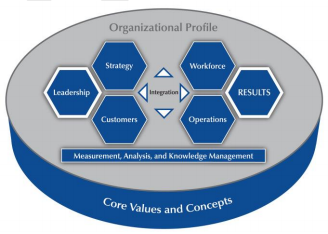

Baldrige Cybersecurity Excellence Builder DRAFT
=========================================

**Key questions for improving your organization's cybersecurity performance**

- Draft September 2016
- National Institute of Standards and Technology

Feedback on this draft release of the Baldrige Cybersecurity Excellence
Framework will be incorporated into the version 1 release, scheduled
for early 2017 . Please submit feedback to [baldrigecybersecurity @ nist.gov](mailto:baldrigecybersecurity@nist.gov) by December 15, 2016.

Contents
========

* [Introduction](#introduction)
	* [What is the Baldrige Cybersecurity Excellence Builder?](#what-is-the-baldrige-cybersecurity-excellence-builder)
	* [What is the relationship between the <em>Baldrige Cybersecurity Excellence Builder</em> and the <em>Framework for Improving Critical Infrastructure Cybersecurity</em>?](#what-is-the-relationship-between-the-baldrige-cybersecurity-excellence-builder-and-the-framework-for-improving-critical-infrastructure-cybersecurity)
	* [Who in an organization should use the <em>Baldrige Cybersecurity Excellence Builder</em>?](#who-in-an-organization-should-use-the-baldrige-cybersecurity-excellence-builder)
	  * [Board and Executive Management](#board-and-executive-management)
	  * [Chief Information Officer (CIO )](#chief-information-officer-cio-)
	  * [Chief Information Security Officer (CISO )](#chief-information-security-officer-ciso-)
	  * [IT Process Management](#it-process-management)
	  * [Risk Management](#risk-management)
	  * [Legal / Compliance Roles](#legal--compliance-roles)
	  * [Employees (Workforce )](#employees-workforce-)
	* [How can organizations use the Baldrige Cybersecurity Excellence Builder to assess and improve their management of cybersecurity risks?](#how-can-organizations-use-the-baldrige-cybersecurity-excellence-builder-to-assess-and-improve-their-management-of-cybersecurity-risks)
	  * [1. Decide on the scope of your self-assessment.](#1-decide-on-the-scope-of-your-self-assessment)
	  * [2. Complete the Organizational Context.](#2-complete-the-organizational-context)
	  * [3. Answer the process questions in categories 1 – 6.](#3-answer-the-process-questions-in-categories-1--6)
	  * [4. Answer the results questions in category 7.](#4-answer-the-results-questions-in-category-7)
	  * [5. Assign a descriptor to your responses to each item.](#5-assign-a-descriptor-to-your-responses-to-each-item)
	  * [6. Prioritize your actions.](#6-prioritize-your-actions)
	  * [7. Develop an action plan, implement it, and measure and evaluate your progress.](#7-develop-an-action-plan-implement-it-and-measure-and-evaluate-your-progress)
  * [Organizational Context](#organizational-context)
	  * [C. 1 Organizational Description : What are your key organizational characteristics?](#c-1-organizational-description--what-are-your-key-organizational-characteristics)
		* [a. Organizational Environment](#a-organizational-environment)
		* [b. Organizational Relationships](#b-organizational-relationships)
	  * [C. 2 Organizational Situation : What is your organization's strategic situation?](#c-2-organizational-situation--what-is-your-organizations-strategic-situation)
		* [a. Competitive Environment](#a-competitive-environment)
		* [b. Strategic Context](#b-strategic-context)
		* [c. PERFORMANCE Improvement System](#c-performance-improvement-system)
* [Cybersecurity Processes](#cybersecurity-processes)
  * [1 Leadership](#1-leadership)
	* [1.1 Senior and Cybersecurity Leadership : How do your senior and cybersecurity leaders lead your cybersecurity policies and operations?](#11-senior-and-cybersecurity-leadership--how-do-your-senior-and-cybersecurity-leaders-lead-your-cybersecurity-policies-and-operations)
	* [1.2 Governance and Societal Responsibilities : How do you govern your cybersecurity policies and operations and fulfill your organization's societal responsibilities?](#12-governance-and-societal-responsibilities--how-do-you-govern-your-cybersecurity-policies-and-operations-and-fulfill-your-organizations-societal-responsibilities)
  * [2 Strategy](#2-strategy)
	* [2.1 Strategy Development : How do you develop your cybersecurity strategy?](#21-strategy-development--how-do-you-develop-your-cybersecurity-strategy)
	* [2.2 Strategy Implementation : How do you implement your cybersecurity strategy?](#22-strategy-implementation--how-do-you-implement-your-cybersecurity-strategy)
  * [3 Customers](#3-customers)
	* [3.1 Voice of the Customer : How do you obtain information from your customers?](#31-voice-of-the-customer--how-do-you-obtain-information-from-your-customers)
	* [3.2 Customer Engagement : How do you engage customers by serving their needs and building relationships?](#32-customer-engagement--how-do-you-engage-customers-by-serving-their-needs-and-building-relationships)
  * [4 Measurement, Analysis, and Knowledge Management](#4-measurement-analysis-and-knowledge-management)
	* [4.1 Measurement, Analysis, and Improvement of Performance : How do you measure, analyze, and then improve cybersecurity-related performance?](#41-measurement-analysis-and-improvement-of-performance--how-do-you-measure-analyze-and-then-improve-cybersecurity-related-performance)
	* [4.2 Knowledge Management : How do you manage your organization's cybersecurityrelated knowledge assets?](#42-knowledge-management--how-do-you-manage-your-organizations-cybersecurityrelated-knowledge-assets)
  * [5 Workforce](#5-workforce)
	* [5.1 Workforce Environment : How do you build an effective and supportive workforce environment to achieve your cybersecurity goals?](#51-workforce-environment--how-do-you-build-an-effective-and-supportive-workforce-environment-to-achieve-your-cybersecurity-goals)
	* [5.2 Workforce Engagement : How do you engage your workforce to achieve a highperformance work environment in support of cybersecurity policies and operations?](#52-workforce-engagement--how-do-you-engage-your-workforce-to-achieve-a-highperformance-work-environment-in-support-of-cybersecurity-policies-and-operations)
  * [6 Operations](#6-operations)
	* [6.1 Work Processes : How do you design, manage, and improve your key cybersecurity work processes?](#61-work-processes--how-do-you-design-manage-and-improve-your-key-cybersecurity-work-processes)
	  * [a. CYBERSECURITY PROCESS Design, Management, and Improvement](#a-cybersecurity-process-design-management-and-improvement)
	  * [b. PROTECTION of Assets and Systems](#b-protection-of-assets-and-systems)
	  * [c. DETECTION of CYBERSECURITY Events](#c-detection-of-cybersecurity-events)
	  * [d. RESPONSE to CYBERSECURITY Events](#d-response-to-cybersecurity-events)
	  * [e. RECOVERY from CYBERSECURITY Events](#e-recovery-from-cybersecurity-events)
	* [6.2 Operational Effectiveness : How do you ensure effective management](#62-operational-effectiveness--how-do-you-ensure-effective-management)
  * [7 Results](#7-results)
	* [7.1 Process Results : What are your cybersecurity performance and process effectiveness results?](#71-process-results--what-are-your-cybersecurity-performance-and-process-effectiveness-results)
	* [7.2 Customer Results : What are your customer-focused cybersecurity performance results?](#72-customer-results--what-are-your-customer-focused-cybersecurity-performance-results)
	* [7.3 Workforce Results : What are your workforce-focused cybersecurity performance results?](#73-workforce-results--what-are-your-workforce-focused-cybersecurity-performance-results)
	* [7.4 Leadership and Governance Results : What are your cybersecurity leadership and governance results?](#74-leadership-and-governance-results--what-are-your-cybersecurity-leadership-and-governance-results)
	* [7.5 Financial Results : What are your financial performance results for your cybersecurity operations?](#75-financial-results--what-are-your-financial-performance-results-for-your-cybersecurity-operations)
* [Evaluating Your Responses](#evaluating-your-responses)
	  * [1. For each item (e. g., 1.1, 1.2) in categories 1 – 7 of the <em>Baldrige Cybersecurity Excellence Builder</em>, use the process and results rubrics on pages 24 – 25 to assign a descriptor (Reactive, Early, Mature, or Role Model) for each evaluation factor.](#1-for-each-item-e-g-11-12-in-categories-1--7-of-the-baldrige-cybersecurity-excellence-builder-use-the-process-and-results-rubrics-on-pages-24--25-to-assign-a-descriptor-reactive-early-mature-or-role-model-for-each-evaluation-factor)
	  * [2. Indicate the importance (high, medium, or low) of each item to the successful management of cybersecurity within your organization.](#2-indicate-the-importance-high-medium-or-low-of-each-item-to-the-successful-management-of-cybersecurity-within-your-organization)
	  * [3. Prioritize your actions.](#3-prioritize-your-actions)
* [Assessment Rubric](#assessment-rubric)
* [Self-Analysis Worksheet](#self-analysis-worksheet)
	* [5.2 Workforce Engagement : How do you engage your workforce to achieve a](#52-workforce-engagement--how-do-you-engage-your-workforce-to-achieve-a)
* [Glossary of Key Terms](#glossary-of-key-terms)
* [Appendix : <em>Baldrige Cybersecurity Excellence Builder</em> – Cybersecurity Framework Crosswalk](#appendix--baldrige-cybersecurity-excellence-builder--cybersecurity-framework-crosswalk)

# Introduction

### What is the Baldrige Cybersecurity Excellence Builder?

The Baldrige Cybersecurity Excellence Builder is a voluntary
self-assessment tool that enables organizations to better understand the
effectiveness of their cybersecurity risk management efforts. It helps
leaders of organizations identify opportunities for improvement based on
their cybersecurity needs and objectives, as well as their larger
organizational needs, objectives, and outcomes.

Using this self-assessment, you can:
- determine cybersecurity-related activities that are important to your business strategy and critical service delivery;
- prioritize your investments in managing cybersecurity risk;
- determine how best to enable your workforce, customers, suppliers, partners, and collaborators to be risk conscious and security aware, and to fulfill their cybersecurity roles and responsibilities;
- assess the effectiveness and efficiency of your use of cybersecurity standards, guidelines, and practices;
- assess the cybersecurity results you achieve; and
- identify priorities for improvement.

Like the [Framework for Improving Critical Infrastructure
Cybersecurity](http://www.nist.gov/cyberframework/upload/cybersecurity-framework-021214.pdf)
(*Cybersecurity Framework*) and the [Baldrige
Excellence](https://www.nist.gov/baldrige/publications/baldrige-excellence-framework)
[Framework
,](https://www.nist.gov/baldrige/publications/baldrige-excellence-framework)
the *Baldrige Cybersecurity Excellence Builder* is not a one-size-fits-all
approach. It is adaptable and scalable to your organization's needs,
goals, capabilities, and environment. It does not prescribe how you
should structure your organization's cybersecurity policies and
operations. Through interrelated sets of open-ended questions, it
encourages you to use the approaches that best fit your organization.

### What is the relationship between the *Baldrige Cybersecurity Excellence Builder* and the *Framework for Improving Critical Infrastructure Cybersecurity*?

The *Baldrige Cybersecurity Excellence Builder* blends the systems
perspective of the Baldrige Excellence Framework with the Cybersecurity
Framework.

The *Cybersecurity Framework* assembles and organizes standards,
guidelines, and practices that are working effectively in many
organizations. In the Baldrige approach as applied to cybersecurity,
an organization manages all areas affected by cybersecurity as a unified
whole. As shown in the diagram below, the system consists of your
cybersecurity-related approaches in the areas of leadership, strategy,
customers, workforce, and operations, as well as the results you
achieve. The system foundation is measurement, analysis, and
knowledge management. The background for all of these components is the
Organizational Context. In this set of questions, you define your
organization's distinctive characteristics and situation as they
relate to cybersecurity.

The *Baldrige Cybersecurity Excellence Builder* incorporates the content
outlined in the Cybersecurity Framework into those system elements. The
table in the Appendix shows how the items in the *Baldrige Cybersecurity
Excellence Builder* relate to the elements of the *Cybersecurity Framework*.

### Who in an organization should use the *Baldrige Cybersecurity Excellence Builder*?

The *Baldrige Cybersecurity Excellence Builder* is intended for use by the
leaders and managers in your organization who are concerned with and
responsible for mission-driven, cybersecurity-related policy and
operations. These leaders and managers may include senior leaders,
chief security officers, and chief information officers, among others.

**Role / Function**
- Benefit of / Reason for Using the *Baldrige Cybersecurity Excellence Builder*

#### Board and Executive Management
- Understand how internal and external cybersecurity should support organizational (business ) objectives, including support for customers
- Understand current and planned workforce engagement processes and their success
- Understand opportunities to improve cybersecurity in alignment with organizational objectives
- Understand the potential exposure of the organization's assets to various risks
- Align cybersecurity policy and practices with the organization's mission, vision, and values

#### Chief Information Officer (CIO )
- Understand how cybersecurity affects organizational information management practices and culture
- Improve communication and engagement with organizational leaders and the cybersecurity workforce
- Understand how cybersecurity affects the organization's culture and environment

#### Chief Information Security Officer (CISO )
- Support the organization's commitment to legal and ethical behavior
- Create and apply cybersecurity policy and practices to support the organization's mission, vision, and values
- Respond to rapid or unexpected organizational or external changes
- Support continuous improvement through periodic use of the self-assessment tool
- Support organizational understanding of compliance with various contractual and / or regulatory requirements
- Understand the effectiveness of workforce communication, learning, and engagement, as well as operational considerations for cybersecurity.

#### IT Process Management
- Improve understanding of business requirements and mission objectives and their priorities
- Determine the effectiveness of IT processes and potential improvements Understand how aspects of cybersecurity are integrated with organizational change management processes

#### Risk Management
- Discern the impact of cybersecurity on internal / external customers, partners, and workforce
- Improve understanding of how workforce engagement in cybersecurity and communication to the workforce about cybersecurity impact the organization's overall risk posture

#### Legal / Compliance Roles
- Understand legal / ethical behavior on the part of the workforce, as well as the overall cultural environment
- Understand how the organization applies cybersecurity-related policies and operations to ensure responsible governance, including legal, regulatory, and community concerns

#### Employees (Workforce )
- Understand leaders'expectations
- Be better prepared for changes in cybersecurity capability and capacity needs
- Benefit from a workplace culture and environment characterized by open communication, high performance, and engagement in cybersecurity matters
- Learn to fulfill their cybersecurity roles and responsibilities

### How can organizations use the Baldrige Cybersecurity Excellence Builder to assess and improve their management of cybersecurity risks?

There are 17 items (plus 2 in Organizational Context ), each with a
particular focus. These items are divided into three groups according
to the kinds of information they ask for :

- The Organizational Context asks you to define the organizational environment that informs your cybersecurity risk management program.
- Process items (categories 1 – 6 ) ask you to define your organization’s processes relating to cybersecurity risk management.
- Results items (category 7 ) ask you to report results for your organization's cybersecurity-related processes. 
- The Assessment Rubric (page 25 ) helps you evaluate the effectiveness and efficiency of your cybersecurity-related processes, as well as the quality of your cybersecurity-related results and how they work together as a system.

Here is how you might use the Baldrige Cybersecurity Excellence Builder
in a self-assessment of your organization's cybersecurity-related work.

#### 1. Decide on the scope of your self-assessment.

The *Baldrige Cybersecurity Excellence Builder* is most valuable as a
voluntary assessment of an entire organization's cybersecurity risk
management program, but it is also useful in assessing a subunit,
multiple subunits, or parts of an organization.

#### 2. Complete the Organizational Context.
The Organizational Context section is critically important for the following reasons :

- It helps you identify gaps in key information and focus on key cybersecurity performance requirements and results.
- You can use it as an initial self-assessment. If you identify topics for which conflicting, little, or no information is available, use these topics for action planning.
- It sets the context for and allows you to address unique aspects of your organization's cybersecurity-related needs in your responses to the questions in the rest of the *Baldrige Cybersecurity Excellence Builder*.

#### 3. Answer the process questions in categories 1 – 6.
Many of the questions begin with “ how.” In answering these “ how ”
questions, give information on your organization's key
cybersecurity-related processes :

- *Approach* : How do you accomplish your organization's cybersecurity-related work? How systematic are the key processes you use?
- *Deployment* : How consistently are your key cybersecurity-related processes used in relevant parts of your organization?
- *Learning* : Have you evaluated and improved your key cybersecurity-related processes? Have improvements been shared within your organization?
- *Integration* : How do your cybersecurity-related processes address your
current and future organizational needs?

#### 4. Answer the results questions in category 7.
For these five items, give information on the cybersecurity-related
results that are the most important to your organization's success :

- *Levels* : For your key measures of the effectiveness and efficiency of cybersecurity-related processes, what is your current performance?
- *Trends* : Are the results improving, staying the same, or getting worse?
- *Comparisons* : How does your performance compare with that of other organizations and competitors, or with benchmarks?
- *Integration* : Are you tracking cybersecurity-related results that are important to your organization and consider the expectations and needs of your key stakeholders? Are you using the results in decision-making? 3

#### 5. Assign a descriptor to your responses to each item.

Using the process and results assessment rubrics on pages 25 and 26,
assign a descriptor (Reactive, Early, Mature, or Role Model ) to
your responses.

#### 6. Prioritize your actions.

Celebrate the strengths of your cybersecurity risk management program,
and build on them to improve what you do well. Sharing what you do well
with the rest of your organization can speed improvement.

Also prioritize your opportunities for improving your
cybersecurity-related processes and results; you cannot do everything
at once. Think about what is most important for your organization as a
whole at this time, balancing the differing needs and expectations of
your stakeholders and your expected results, and decide what to work on
first.

#### 7. Develop an action plan, implement it, and measure and evaluate your progress.

As you respond to the questions and gauge your responses against the
rubric, you will begin to identify strengths and gaps — first within
the categories and then among them. The coordination of key processes,
and linkages between your processes and your results, can lead to
cycles of improvement. As you continue to use this assessment tool,
you will learn more and more about your organization and begin to define
the best ways to build on your strengths, close gaps, and innovate.
Completing this voluntary self-assessment might also serve as a first
step in carrying out these suggestions in the Cybersecurity Framework,
section 3.0 (“How to Use the Framework”):

- 3.1 Basic Review of Cybersecurity Processes : Use the information gained from answering the self-assessment questions to compare your current cybersecurity activities with those outlined in the *Cybersecurity Framework* Core.
- 3.2 Establishing or Improving a Cybersecurity Program : Use your answers to the self-assessment questions to inform the steps in creating or improving a cybersecurity program (see also the Appendix ).
- 3.3 Communicating Cybersecurity Requirements with Stakeholders : Your answers to the questions might inform the creation of a Target Profile to express cybersecurity risk management requirements to stakeholders.

## Organizational Context
*Note: Terms in CAPS are defined in the Glossary of Key Terms - (pages 29 – 31 ).*

#### C. 1 Organizational Description : What are your key organizational characteristics?

----

##### a. Organizational Environment
- (1) **Product Offerings** What are your organization's main product / service offerings? What is the relative importance of each to your success? What mechanisms do you use to deliver your products / services ?

- (2) **MISSION, VISION, and VALUES** What are your stated MISSION, VISION, and VALUES? What are your organization's CORE COMPETENCIES, and what is their relationship to your MISSION?

- (3) **WORKFORCE Profile** What is your overall WORKFORCE profile? What is your CYBERSECURITY WORKFORCE profile? What recent changes have you experienced in the composition of your overall and your CYBERSECURITY WORKFORCE or in your needs for them? What are
  - Your overall WORKFORCE and CYBERSECURITY WORKFORCE employee groups and SEGMENTS,
  - the KEY drivers that engage them in accomplishing their work, including CYBERSECURITY-related work, and in achieving your MISSION and VISION?

- (4) **Assets** What are your priorities for protecting your organization’s assets, based on their criticality and business value?

- (5) **Legal and Regulatory Requirements** What are the KEY laws and regulations relating to CYBERSECURITY in your industry? What are the KEY applicable
  - safety regulations relating to CYBERSECURITY;
  - accreditation, certification, or registration requirements relating to CYBERSECURITY;
  - industry CYBERSECURITY standards; and
  - environmental, financial, and product regulations relating to CYBERSECURITY?

##### b. Organizational Relationships

- (1) **Organizational Structure** What are your overall organizational structure and GOVERNANCE system? What are the reporting relationships among your GOVERNANCE board, SENIOR LEADERS, and parent organization, as appropriate? What is the structure of your CYBERSECURITY operations? What are the reporting relationships among your SENIOR LEADERS and your CYBERSECURITY leaders and managers?

- (2) **CUSTOMERS and STAKEHOLDERS** What are your KEY internal and external CUSTOMER groups and STAKEHOLDER groups, as appropriate? What are their KEY requirements and expectations for your CYBERSECURITY policies and operations? What are the differences in these requirements and expectations among CUSTOMER groups and STAKEHOLDER groups?

- (3) **Suppliers and PARTNERS** What are your KEY types of suppliers, PARTNERS, and COLLABORATORS for your organization as a whole and for your CYBERSECURITY operations? What role do they play in producing and delivering your KEY products / services and CUSTOMER support services? What CYBERSECURITY roles do they play in your organization? What are your KEY mechanisms for two-way communication with suppliers, PARTNERS, and COLLABORATORS? What are your KEY supply-chain requirements?

**Notes:**

**C.1a(3).** Your cybersecurity workforce profile might include information on education, tenure, certifications, and other key characteristics. Workforce or employee groups and segments might be based on type of employment or contract-reporting relationship, location - (including telework ), tour of duty, work environment, or other factors.

**C.1a(4).** Assets include physical devices and systems, software platforms and applications, organizational communication and data flows , external information systems, and data and information. You should set priorities for protecting these based on their importance to your mission and business objectives.

**C.1b(2).** Customer groups might be based on common expectations, behaviors, preferences, or profiles. Within a group, there may be customer segments based on differences, commonalities, or both. You might subdivide your market into market segments based on product lines or features, distribution channels, business volume, geography, or other defining factors.

----

#### C. 2 Organizational Situation : What is your organization's strategic situation?

##### a. Competitive Environment

- (1 ) Competitive Position What is your competitive position? What are
your relative size and growth in your industry or the markets you serve
? How many and what types of competitors do you have?

- (2 ) Competitiveness Changes What KEY changes, if any, are affecting
your competitive situation?

- (3 ) Comparative Data What KEY sources of comparative and competitive CYBERSECURITY data are available from within your industry? What KEY sources of comparative CYBERSECURITY data are available from outside your industry? What limitations, if any, affect your ability to obtain or use these data?

##### b. Strategic Context
What are your KEY STRATEGIC CHALLENGES and ADVANTAGES in the areas of overall operations and CYBERSECURITY?

##### c. PERFORMANCE Improvement System

What are the KEY elements of your PERFORMANCE improvement system,
including your PROCESSES for evaluation and improvement of KEY
CYBERSECURITY-related projects and PROCESSES?

**Notes:**

**C2.a(3).** While comparative data about cybersecurity may be
relatively sparse, their use is important for the following reasons :
(1) Your organization needs to know where it stands relative to
competitors and to best practices; (2) comparative information and
information obtained from benchmarking often provide the impetus for
significant improvement or transformational change; (3) comparing
performance information frequently leads to a better understanding of
your processes and their performance; (4) data on competitors ’
performance may reveal organizational advantages as well as challenge
areas; and - (5 ) comparative information may support business analysis
and decisions relating to core competencies, partnering, and
outsourcing.

**C.2c.** Your performance improvement system refers to your overall
approach to improving processes and projects within your organization.
The approach you use should be related to your organization's needs.
Some examples of approaches that are compatible with the overarching
systems approach provided by this self-assessment are Lean, Six Sigma,
Plan-Do-Check-Act, ISO standards, and decision science, among others.

----

# Cybersecurity Processes

## 1 Leadership

----

### 1.1 Senior and Cybersecurity Leadership : How do your senior and cybersecurity leaders lead your cybersecurity policies and operations?

In your response, include answers to the following questions. Assess
your response using the process rubric on page 25.

- (1) HOW do your leaders'actions demonstrate their commitment to CYBERSECURITY?

- (2) HOW do your leaders DEPLOY the organization's MISSION, VISION, and VALUES to the WORKFORCE, to KEY suppliers and PARTNERS, and to KEY CUSTOMERS and other STAKEHOLDERS, as appropriate?

- (3) HOW do your leaders'actions demonstrate their commitment to legal and ETHICAL BEHAVIOR? - (4) HOW do your leaders'actions build CYBERSECURITY policies and operations that are successful now and in the future?

- (5) HOW do your leaders communicate with and engage other organizational leaders, the WORKFORCE, and KEY CUSTOMERS and STAKEHOLDERS regarding CYBERSECURITY?

- (6) HOW do your leaders create a focus on action that will achieve the organization's CYBERSECURITY objectives in ALIGNMENT with its MISSION ?

**Notes:**

**1.1.** In this item, “ leaders ” includes your organization's senior
leaders and those specifically responsible for overseeing and executing
cybersecurity risk management and operations. Leadership on
cybersecurity policies and approaches ideally resides at multiple
organizational levels. Your organization should decide whether each
question refers to all senior leaders or your cybersecurity leaders.

**Q4.** To build successful cybersecurity policies and operations that are
successful now and in the future, leaders should create an environment
for improvement and learning; create a workforce culture that fosters
engagement in cybersecurity matters; and create an environment for
innovation and intelligent risk taking, achievement of your
cybersecurity strategic objectives, and operational agility.

**Q6.** Leaders should create a focus on actions that will improve
cybersecurity performance and achieve innovation and intelligent risk
taking. In setting expectations for cybersecurity-related performance,
they should include a focus on creating and balancing value for
customers and other stakeholders.

----

### 1.2 Governance and Societal Responsibilities : How do you govern your cybersecurity policies and operations and fulfill your organization's societal responsibilities?

In your response, include answers to the following questions. Assess
your response using the process rubric on page 25.

- (1) HOW does your organization ensure responsible GOVERNANCE of its CYBERSECURITY policies and operations?

- (2) HOW do you address legal, regulatory, and community concerns with your CYBERSECURITY-related policies and operations?

- (3) HOW do you promote and ensure ETHICAL BEHAVIOR in all CYBERSECURITY-related interactions?

- (4) HOW do you actively support and strengthen the CYBERSECURITY infrastructure of your KEY communities ?

**Notes:**

**Q3.** Some examples of measures of ethical behavior are the percentage of
independent board members, instances of ethical conduct or compliance
breaches and responses to them, survey results showing workforce
perceptions of organizational ethics, ethics hotline use, and results
of ethics reviews and audits. Other measures might be evidence that
policies, workforce training, and monitoring systems are in place for
conflicts of interest.

**Q4.** To support and strengthen key communities, an organization might
identify these key communities, determine areas for involvement (e.g.,
areas for external participation in improving cybersecurity), and
contribute to the improvement of cybersecurity in those key communities.

----

## 2 Strategy

### 2.1 Strategy Development : How do you develop your cybersecurity strategy?

In your response, include answers to the following questions. Assess
your response using the process rubric on page 25.

- (1) HOW do you conduct your CYBERSECURITY strategic planning?

- (2) HOW do you ensure ALIGNMENT between your CYBERSECURITY strategic planning and your organization's overall strategic planning?

- (3) HOW does your CYBERSECURITY strategy development PROCESS stimulate and incorporate INNOVATION?

- (4) HOW do you collect and analyze relevant data and develop information for your CYBERSECURITY strategic planning PROCESS?

- (5) HOW do you decide which KEY CYBERSECURITY PROCESSES will be accomplished by your WORKFORCE and which by external suppliers and PARTNERS?

- (6) What are your organization's KEY CYBERSECURITY STRATEGIC OBJECTIVES and timetable for achieving them?

- (7) How do your organization's KEY CYBERSECURITY STRATEGIC OBJECTIVES relate to your organization's overall STRATEGIC OBJECTIVES?

- (8) HOW do your CYBERSECURITY STRATEGIC OBJECTIVES achieve appropriate balance among varying and potentially competing organizational needs, including the balance between CUSTOMER and STAKEHOLDER requirements and business objectives?

**Notes:**

**2.1.** Strategy development refers to your organization's approach to
preparing for the future. In developing your strategy, you might use
various types of forecasts, projections, options, scenarios,
knowledge, analyses, or other approaches to envisioning the future in
order to make decisions and allocate resources. As appropriate, you
might involve key suppliers, distributors, partners, and customers in
your strategy development.

**Q3.** Innovation refers to making meaningful change to improve products /
services, processes, or organizational effectiveness and create new
value for stakeholders. Innovation involves adopting an idea, process
, technology, product, or business model that is either new or new to
its proposed application. The outcome of innovation is a discontinuous
or “ breakthrough ” change in results, products / services, or
processes. Innovation benefits from a supportive environment, a
process for identifying strategic opportunities, and a willingness to
pursue intelligent risks.

**Q4.** The data and information you collect and analyze might relate to
current and future cybersecurity risks locally, nationally, and
globally; requirements for and strengths and weaknesses of your
partners and supply chain; customer requirements, expectations, and
opportunities, including privacy; your core competencies; the
competitive environment and your performance now and in the future
relative to competitors and comparable organizations; your products and
services; technological and other key innovations or changes that might
affect your products and services and the way you operate; workforce
and other resource needs; opportunities to redirect resources to
higher-priority products, services, or areas; financial, societal,
ethical, regulatory, technological, and other potential risks and
opportunities; your ability to prevent and respond to emergencies;
changes in the local, national, or global economy; changes in your
parent organization; and other factors unique to your organization.

----

### 2.2 Strategy Implementation : How do you implement your cybersecurity strategy?

In your response, include answers to the following questions. Assess
your response using the process rubric on page 25.

- (1) What are your KEY short- and longer-term CYBERSECURITY ACTION PLANS?

- (2) HOW do you DEPLOY your CYBERSECURITY ACTION PLANS?

- (3) HOW do you ensure that financial and other resources are available to support the achievement of your CYBERSECURITY ACTION PLANS while you meet current obligations?

- (4) What are your KEY WORKFORCE plans to support your short- and longer-term CYBERSECURITY STRATEGIC OBJECTIVES and ACTION PLANS?

- (5) What KEY PERFORMANCE MEASURES or INDICATORS do you use to track the achievement and EFFECTIVENESS of your CYBERSECURITY ACTION PLANS?

- (6) For these KEY PERFORMANCE MEASURES or INDICATORS, what are your PERFORMANCE PROJECTIONS for your short- and longerterm planning horizons?

- (7) HOW do you establish and implement modified CYBERSECURITY ACTION PLANS if circumstances require a shift in plans and rapid execution of new plans?

**Notes:**

**2.2.** The development and deployment of your cybersecurity strategy and
action plans are closely linked to other items. The following are
examples of key linkages :

  - Item 1.1 : how your leaders communicate organizational direction

  - Category 3 : how you gather internal and external customer knowledge as input to your cybersecurity strategy and action plans and to use in deploying action plans

  - Category 4 : how you measure and analyze cybersecurity data and manage cybersecurity knowledge to support key information needs, support the development of cybersecurity strategy, provide an effective basis for cybersecurity performance measurements, and track progress on achieving cybersecurity strategic objectives and action plans

  - Category 5 : how you meet cybersecurity workforce capability and capacity needs, determine needs and design your overall and cybersecurity workforce development and learning system, and implement workforce-related changes resulting from action plans

  - Category 6 : how you address changes to your cybersecurity work processes resulting from action plans
  
  - Item 7.1 : specific accomplishments relative to your cybersecurity strategy and action plans

----

## 3 Customers

### 3.1 Voice of the Customer : How do you obtain information from your customers?

In your response, include answers to the following questions. Assess
your response using the process rubric on page 25.

- (1) HOW do you listen to, interact with, and observe internal and external CUSTOMERS to obtain actionable information?

- (2) HOW do you determine internal and external CUSTOMERS’ satisfaction, dissatisfaction, and ENGAGEMENT with your organization’s CYBERSECURITY policies and operations?

**Notes:**

**3.1.** The voice of the customer refers to your process for capturing
customer-related information. Voice-of-the-customer processes are
intended to be proactive and continuously innovative so that they
capture stated, unstated, and anticipated customer requirements,
expectations, and desires. The goal is customer engagement. In
listening to the voice of the customer, you might gather and integrate
various types of customer data, such as survey data, focus group
findings, blog comments and data from other social media, warranty
data, marketing and sales information, and complaint data that affect
customers'purchasing and engagement decisions.

**Q2.** You might use any or all of the following to determine customer
satisfaction and dissatisfaction : surveys, formal and informal
feedback, customer account histories, complaints, field reports, win
/ loss analysis, customer referral rates, and transaction completion
rates. You might gather information on the web, through personal
contact or a third party, or by mail. Determining customer
dissatisfaction should be seen as more than reviewing low customer
satisfaction scores. Dissatisfaction should be independently determined
to identify root causes and enable a systematic remedy to avoid future
dissatisfaction.

**Q3.** Information on relative customer satisfaction may include
comparisons with competitors, comparisons with other organizations that
deliver similar products / services in a noncompetitive marketplace, or
comparisons obtained through trade or other organizations. Information
obtained on relative customer satisfaction may also include information
on why customers choose your competitors over you.

### 3.2 Customer Engagement : How do you engage customers by serving their needs and building relationships?

In your response, include answers to the following questions. Assess
your response using the process rubric on page 25.

- (1) HOW do you enable internal and external CUSTOMERS to seek information and support related to your CYBERSECURITY policies and operations?

- (2) HOW do you build and manage internal and external CUSTOMER relationships to increase cooperation and ENGAGEMENT on CYBERSECURITY matters?

- (3) HOW do you ensure that external CUSTOMERS understand and fulfill
their CYBERSECURITY roles and responsibilities? - (4) HOW do you manage internal andexternal CUSTOMER complaints about your CYBERSECURITY
policies and operations?

**Notes:**

**3.2.** Your results for customer perceptions and actions (outcomes)
should be reported in item 7.2.

**Q1.** Your approach to enabling customers to seek information and support
should include provisions to protect privacy and civil liberties when
personal information is used, collected, processed, maintained, or
disclosed in connection with your organization's cybersecurity
activities. Some examples of activities with privacy or civil liberties
considerations include cybersecurity activities that may result in the
overcollection or overretention of personal information; disclosure or
use of personal information unrelated to cybersecurity activities; and
cybersecurity mitigation activities that result in denial of service or
other similar potentially adverse impacts, including incident detection
or monitoring that may impact freedom of expression or association.

Privacy principles to consider incorporating in cybersecurity policies
and operations include minimizing the collection, disclosure, and
retention of personal information related to the cybersecurity incident
; use limitations outside of cybersecurity activities on any information
collected specifically for cybersecurity activities; transparency for
certain cybersecurity activities; individual consent and redress for
adverse impacts arising from use of personal information in
cybersecurity activities; data quality, integrity, and security; and
accountability and auditing.

----

## 4 Measurement, Analysis, and Knowledge Management

### 4.1 Measurement, Analysis, and Improvement of Performance : How do you measure, analyze, and then improve cybersecurity-related performance?

In your response, include answers to the following questions. Assess
your response using the process rubric on page 25.

- (1) HOW do you track data and information on daily CYBERSECURITY operations and overall CYBERSECURITY PERFORMANCE?

- (2) What are your KEY CYBERSECURITY PERFORMANCE MEASURES?

- (3) HOW do you select comparative data and information to support fact-based decision making on CYBERSECURITY policies and operations?

- (4) HOW do you select VOICE-OF-THE-CUSTOMER and market data and information to support fact-based decision making on CYBERSECURITY policies and operations?

- (5) HOW do you ensure that your measurement of CYBERSECURITY PERFORMANCE can respond to rapid or unexpected organizational or external changes?

- (6) HOW do you review your organization's CYBERSECURITY PERFORMANCE and capabilities?

- (7) HOW do you project your organization's future CYBERSECURITY PERFORMANCE?

- (8) HOW do you use findings from PERFORMANCE reviews (addressed in question 6) to develop and DEPLOY priorities for continuous improvement and opportunities for INNOVATION in your CYBERSECURITY policies and operations?

**Notes:**

**4.1.** The results of cybersecurity-related performance analysis and
review should inform the strategy development and implementation you
describe in category 2. Your cybersecurity-related performance results
should be reported in items 7.1 – 7.5.

**Q3.** Organizations obtain comparative data and information benchmarking
and by seeking competitive comparisons. Benchmarking is identifying
processes and results that represent best practices and performance for
similar activities, inside or outside your industry. Competitive
comparisons relate your performance to that of competitors and other
organizations providing similar products and services.

**Q6.** Your reviews of cybersecurity performance should be informed by
performance measures identified throughout this selfassessment tool,
and they should be guided by the strategic objectives and action plans
you identify in category 2. Reviews might include a review by your
organization's governance board.

### 4.2 Knowledge Management : How do you manage your organization's cybersecurityrelated knowledge assets?

In your response, include answers to the following questions. Assess
your response using the process rubric on page 25. 

- (1) HOW do you manage your organization's CYBERSECURITY-related knowledge?

- (2) HOW do you use your knowledge and resources to embed LEARNING in the way your CYBERSECURITY operations function?

- (3) HOW do you maintain your organization's awareness of a continually changing CYBERSECURITY threat environment?

- (4) HOW do you share CYBERSECURITY best practices in your organization and with CUSTOMERS, suppliers, and PARTNERS, as appropriate?

- (5) HOW do you verify and ensure the quality of organizational data and information related to CYBERSECURITY?

**Notes:**

**Q1.** To manage cybersecurity-related knowledge, an organization
collects and transfers workforce knowledge related to cybersecurity;
blends and correlates cybersecurity-related data from different sources
to build new knowledge; transfers relevant cybersecurity-related
knowledge from and to customers, suppliers, partners, and
collaborators; and assembles and transfers relevant
cybersecurity-related knowledge for use in innovation and strategic
planning processes.

**Q2.** Embedding learning in the way your organization operates means that
learning - (1) is a part of everyday cybersecurity work; - (2) results
in solving problems at their source; - (3) is focused on building and
sharing cybersecurity knowledge throughout your organization and - (4)
is driven by opportunities to bring about significant, meaningful
change and to innovate with regard to cybersecurity.

----

## 5 Workforce

### 5.1 Workforce Environment : How do you build an effective and supportive workforce environment to achieve your cybersecurity goals?

In your response, include answers to the following questions. Assess
your response using the process rubric on page 25.

- (1) HOW do you assess your WORKFORCE CAPABILITY and CAPACITY needs related to CYBERSECURITY?

- (2) HOW do you recruit, hire, place, and retain new CYBERSECURITY WORKFORCE members?

- (3) HOW do you organize and manage your CYBERSECURITY WORKFORCE to establish roles and responsibilities?

- (4) HOW do you prepare your WORKFORCE for changing CYBERSECURITY CAPABILITY and CAPACITY needs?

**Notes:**

**5.** The questions in this category focus on either your overall
workforce or your CYBERSECURITY workforce, as you determine to be
appropriate.

**5.1.** Your cybersecurity workforce consists of the people actively
involved in accomplishing your organization's cybersecurity work. It
includes permanent, temporary, and part-time personnel, as well as
any contract employees you supervise. It includes team leaders,
supervisors, and managers at all levels.

**Q1.** Workforce capability is your organization's ability to carry out
its work processes through its people's knowledge, skills, abilities, and competencies.

Workforce capacity is your organization's ability to ensure sufficient
staffing levels to carry out its work processes, including the ability
to meet seasonal or varying demand levels.

**Q1.** In assessing your workforce capability and capacity needs, you
should consider not only current needs but also future requirements
based on the strategic objectives and action plans you identify in
category 2.

**Q2.** This question refers only to new workforce members. For the
retention of existing workforce members, see item 5.2, Workforce
Engagement.

**Q4.** Preparing your workforce for changing capability and capacity needs
may involve managing your workforce for change as you address changes in
your external environment, culture, technology, or strategic
objectives. These changes could be organizational (e. g., a merger
with another group, or exponential growth or downsizing) or could
reflect a significant change in the threat landscape (e. g., newly
discovered vulnerabilities or risks from new technology). Addressing
these capability and capacity needs might include training, education,
more frequent communication, consideration of workforce employment and
employability, career counseling, and outplacement and other services.

### 5.2 Workforce Engagement : How do you engage your workforce to achieve a highperformance work environment in support of cybersecurity policies and operations?

In your response, include answers to the following questions. Assess
your response using the process rubric on page 25.

- (1) HOW do you foster an organizational culture that is characterized by open communication, HIGH PERFORMANCE, and a WORKFORCE that is engaged in CYBERSECURITY matters?

- (2) HOW do you assess the ENGAGEMENT of your organization's overall WORKFORCE in CYBERSECURITY matters?

- (3) HOW does your WORKFORCE PERFORMANCE management system support WORKFORCE ENGAGEMENT in CYBERSECURITY matters and HIGH PERFORMANCE in WORKFORCE members'fulfillment of their CYBERSECURITY roles and responsibilities?

- (4) HOW does your LEARNING and development system support your organization's needs and the development of your organization's overall WORKFORCE members, managers, and leaders in fulfilling their CYBERSECURITY roles and

- (5) HOW do you evaluate the EFFECTIVENESS and efficiency of your CYBERSECURITY LEARNING and development system? - (6) HOW do you carry out succession planning for KEY CYBERSECURITY management and leadership positions?

Notes Q1 – Q6. These questions refer to your organization's entire
workforce.

Q2. Drivers of workforce engagement (identified in C. 1a \[ 3 \])
refer to the drivers of workforce members'commitment, both emotional
and intellectual, to accomplishing the organization's work (
including cybersecurity-related work), mission, and vision.

## 6 Operations

### 6.1 Work Processes : How do you design, manage, and improve your key cybersecurity work processes?

In your response, include answers to the following questions. Assess
your response using the process rubric on page 25.

#### a. CYBERSECURITY PROCESS Design, Management, and Improvement

- (1) HOW do you determine KEY CYBERSECURITY WORK PROCESS requirements?

- (2) HOW do you design your CYBERSECURITY WORK PROCESSES to meet requirements?

- (3) HOW does your day-to-day operation of CYBERSECURITY WORK PROCESSES ensure that they meet KEY PROCESS requirements?

- (4) HOW do you determine the KEY support PROCESSES that enable your CYBERSECURITY operations?

- (5) HOW do you improve your CYBERSECURITY WORK PROCESSES to improve their PERFORMANCE and reduce variability?

- (6) HOW do you manage opportunities for INNOVATION in your CYBERSECURITY operations?

#### b. PROTECTION of Assets and Systems

- (1) HOW do you limit access to assets and associated facilities to authorized users, PROCESSES, or devices, and to authorized activities and transactions?

- (2) HOW do you manage information and records - (data) consistent with your risk strategy to PROTECT their confidentiality and integrity, and ensure their availability?

- (3) HOW do you maintain and use security policies - (that address purpose, scope, roles, responsibilities, management commitment, and coordination among organizational entities), PROCESSES, and procedures to manage PROTECTION of information systems and assets?

- (4) HOW do you maintain and repair industrial control and information system components consistent with policies and procedures?

- (5) HOW do you manage technical security solutions to ensure the security and resilience of systems and assets consistent with related policies, procedures, and agreements?

#### c. DETECTION of CYBERSECURITY Events

- (1) HOW do you DETECT anomalies in a timely manner and assess the impact of CYBERSECURITY events?

- (2) HOW do you monitor information systems and assets at discrete intervals to identify CYBERSECURITY events and verify the effectiveness of protective measures?

- (3) HOW do you maintain and test DETECTION PROCESSES and procedures to
ensure timely and adequate awareness of anomalies?

#### d. RESPONSE to CYBERSECURITY Events

- (1) HOW do you execute and maintain RESPONSE PROCESSES and procedures to ensure timely RESPONSE to detected CYBERSECURITY events?

- (2) HOW do you coordinate RESPONSE activities with other WORKFORCE units, CUSTOMERS, and STAKEHOLDERS, as appropriate, including external law enforcement agencies?

- (3) HOW do you analyze your RESPONSE activities to ensure adequate RESPONSE and support RECOVERY activities?

- (4) HOW do you limit expansion of an event, mitigate its effects, and eradicate the event?

#### e. RECOVERY from CYBERSECURITY Events

- (1) HOW do you execute and maintain RECOVERY PROCESSES and procedures to ensure timely restoration of systems or assets affected by CYBERSECURITY events?

- (2) HOW do you coordinate RECOVERY activities with other WORKFORCE units, CUSTOMERS, and STAKEHOLDERS, such as coordinating centers, Internet service providers, victims, other computer security incident RESPONSE teams, and vendors?

**Notes:**

6.1a - (3). Ensuring that your day-to-day operation of work processes
meets requirements includes establishing key performance measures or
in-process measures to control and improve these processes.

6.1a - (4). Support processes for your key cybersecurity work processes
might include finance and human resource processes, for example.

6.1a - (5). The results of improvements in process performance should be
reported in item 7.1. To improve process performance and reduce
variability, you might implement approaches such as a Lean Enterprise
System, Six Sigma methodology, ISO quality system standards, PDCA
methodology, decision sciences, or other process improvement tools.
These approaches might be part of the performance improvement system you
describe in C. 2c in the Organizational Context section.

### 6.2 Operational Effectiveness : How do you ensure effective management
of your cybersecurity operations?

In your response, include answers to the following questions. Assess
your response using the process rubric on page 25. - (1) HOW do you
control the overall costs of your CYBERSECURITY operations?

- (2) HOW do you ensure that your suppliers and PARTNERS understand and
fulfill their CYBERSECURITY roles and responsibilities?

- (3) HOW do you manage your CYBERSECURITY-related supply chain? - (4)
HOW do you ensure that your CYBERSECURITY operations consider and align
with your organization's overall operations?

- (5) HOW do you ensure that your CYBERSECURITY operations consider and
align with your organization's overall operational safety system?

- (6) HOW do you ensure that your organization incorporates
CYBERSECURITY considerations and operations in its preparation for
disasters or emergencies?

- (7) In the event of an emergency, HOW do you ensure that systems and
assets continue to be secure and available to serve CUSTOMERS and
business needs?

**Notes:**

**Q2.** Managing your supply chain includes selecting suppliers and
ensuring that they are qualified and positioned to not only meet
operational needs but also enhance your performance and your customers ’
satisfaction, measuring and evaluating your suppliers'performance,
providing feedback to your suppliers to help them improve, and dealing
with poorly performing suppliers.

----

## 7 Results

### 7.1 Process Results : What are your cybersecurity performance and process effectiveness results?

Provide data and information to answer the following questions. Assess
your response using the results rubric on page 26.

- (1) What are your RESULTS for the PROTECTION of your systems and assets?

- (2) What are your RESULTS for the DETECTION of CYBERSECURITY EVENTS?

- (3) What are your RESULTS for your RESPONSE to CYBERSECURITY EVENTS?

- (4) What are your RESULTS for your RECOVERY from CYBERSECURITY EVENTS?

- (5) What are your PROCESS EFFECTIVENESS and efficiency RESULTS for your CYBERSECURITY operations?

- (6) What are your emergency preparedness RESULTS for your CYBERSECURITY operations?

- (7) What are your RESULTS for suppliers'and PARTNERS'understanding and fulfillment of their CYBERSECURITY roles and responsibilities?

- (8) What are your RESULTS for management of your CYBERSECURITY supply chain?

**Notes:**

**7.** The results you report in items 7.1 – 7.5 should provide key
information for analyzing and reviewing your cybersecurity-related
performance (item 4.1), demonstrate use of cybersecurity knowledge
(item 4.2), and provide the operational basis for customer-focused
results (item 7.2) and financial results (item 7.5). There is not a
one-to-one correspondence between results items and categories 1 – 6.
Results should be considered systemically, with contributions to
individual results items frequently stemming from processes in more than
one category.

Q1 – Q8. The results you report here should address the key operational
requirements you identify in the Organizational Context section and in
category 6.

**Q1.** Results for the protection of systems and assets should relate to
the protection processes you describe in category 6. These results
might include, for example, the percentage of devices and / or
software accurately recorded in inventory, the percentage of devices
configured according to policy, the percentage of critical information
servers supported by strong authentication, and the number of
facilities with PIV-based electronic locks

**Q2.** Results for the detection of cybersecurity events should relate to
the detection processes you report in category 6. These results might
include, for example, the number of anomalies detected, investigated
, and resolved, and the percentage of planned vulnerability mitigation
actions effectively completed.

**Q3.** Results for your response to cybersecurity events should relate to
the response processes you report in category 6. These results might
include, for example, incident recovery and response time, number of
disaster recovery incidents, and number of reports shared with
Information Sharing and Analysis Organizations or other appropriate
third parties.

**Q4.** Results for your recovery from cybersecurity events should relate
to the recovery processes you report in category 6. These results might
include, for example, the time to restore lost availability and the
time to access alternate availability mechanisms and restore services.

**Q5.** Process effectiveness and efficiency results for your cybersecurity
operations might include those for simplification of jobs, waste
reduction, and work layout improvements.

**Q6.** Emergency preparedness results might include the cybersecurity
operation's response times for emergency drills or exercises and
results for work relocation or contingency exercises.

**Q8.** Results for cybersecurity supply-chain performance might include
the percentage of contracts that include cybersecurity monitoring and
reporting requirements; supplier and partner audits; and acceptance
results for externally provided services and processes, as well as
improvements in downstream supplier services to customers.

### 7.2 Customer Results : What are your customer-focused cybersecurity performance results?

Provide data and information to answer the following questions. Assess
your response using the results rubric on page 26.

- (1) What are your RESULTS for your internal and external CUSTOMERS ’ satisfaction and dissatisfaction with your CYBERSECURITY policies and operations?

- (2) What are your RESULTS for your internal and external CUSTOMERS ’ ENGAGEMENT with your organization's CYBERSECURITY policies and operations?

- (3) What are your RESULTS for your internal and external CUSTOMERS ’ understanding and fulfillment of their CYBERSECURITY roles and responsibilities?

**Notes:**

**7.2.** Results for customer satisfaction, dissatisfaction, engagement,
and relationship building should relate to the customer groups you
identify in C. 1b (2) and to the listening and determination methods
you report in item 3.1.

**Q1.** Results might include, for example, survey results on customer
satisfaction and dissatisfaction with cybersecurity and privacy, number
of complaints about cybersecurity issues.

**Q2.** Results might include, for example, the number of customer
systems applying multifactor (strengthened) authentication, or the
percentage of customers who change passwords regularly.

**Q3.** Results might include, for example, the number of potential
incidents reported by external customers, the requirements for
service-level agreements regarding recovery of critical customer systems
, and the percentage of customers who have changed their passwords
within a specified time period.

### 7.3 Workforce Results : What are your workforce-focused cybersecurity performance results?

Provide data and information to answer the following questions. Assess
your response using the results rubric on page 26.

- (1) What are your CAPABILITY and CAPACITY RESULTS for your CYBERSECURITY WORKFORCE?

- (2) What are your RESULTS for the ENGAGEMENT of your WORKFORCE in CYBERSECURITY matters?

- (3) What are your RESULTS for WORKFORCE members'fulfillment of their CYBERSECURITY roles and responsibilities?

- (4) What are your WORKFORCE and leader development RESULTS related to CYBERSECURITY?

**Notes:**

**7.3.** Results reported in this item should relate to the processes you
report in category 5. Your results should also respond to the key work
process needs you report in category 6 and to the action plans you
report in item 2.2.

**Q1.** Results might include, for example, the number of qualified
referrals received through employee recommendations, the percentage of
cybersecurity vacancies remaining open for a specified number of days,
and the percentage of staff members who have achieved necessary
qualifications (e. g., CISM, CISSP).

**Q2.** Results should relate to the workforce engagement drivers you
describe in C. 1a (3) and the methods of assessing engagement you
describe in item 5.2.

**Q3.** Results might include, for example, the percentage of employees
who complete role-specific cybersecurity training, cybersecurity
management training Hours per FTE, the percentage of employees trained
on incident handing, the percentage of employees trained to recognize
and avoid email scams, the percentage of employees trained on how to
secure an email browser, the number of employees trained on use of
guidelines for cell phone and PDA security, and the percentage of users
who did not change their passwords in a timely manner.

### 7.4 Leadership and Governance Results : What are your cybersecurity leadership and governance results?

Provide data and information to answer the following questions. Assess
your response using the results rubric on page 26.

- (1) What are your RESULTS for leaders'communication and engagement with your organization's other leaders, your WORKFORCE, and your KEY CUSTOMERS and STAKEHOLDERS regarding CYBERSECURITY?

- (2) What are your RESULTS for GOVERNANCE accountability related to CYBERSECURITY?

- (3) What are your legal and regulatory RESULTS related to CYBERSECURITY?

- (4) What are your RESULTS for ETHICAL BEHAVIOR related to CYBERSECURITY?

- (5) What are your RESULTS for support of the CYBERSECURITY infrastructure of your KEY communities?

- (6) What are your RESULTS for the achievement of your CYBERSECURITY strategy and ACTION PLANS?

**Notes:**

**Q1.** Responses should include results relating to the communication
processes you identify in item 1.1.

**Q2.** Responses should include results relating to the governance
processes you describe in item 1.1. These results might include
financial statement issues and risks, important internal and external
auditor recommendations, and management's responses to these matters.

**Q3.** Legal and regulatory results should relate to the processes and
measures you describe in item 1.2. Examples might be the percentage of
business systems in compliance with legal and regulatory requirements,
the number of compliance breaches, and the frequency of warnings /
violation notices for cybersecurity infractions.

**Q4.** Responses should include results relating to the processes for
ensuring ethical behavior that you identify in item 1.2.

**Q5.** Results for support of the cybersecurity infrastructure of your key
communities might include the extent of collaboration to improve
cybersecurity and results showing the effectiveness of that
collaboration (e. g., improved detection using shared indicators of
compromise).

**Q6.** Results for strategy and action plan achievement should relate to
the strategic objectives and goals you report in item 2.1 and the action
plan performance measures you report in item 2.2.

### 7.5 Financial Results : What are your financial performance results for your cybersecurity operations?

Provide data and information to answer the following questions. Assess
your response using the results rubric on page 26. (1) What are your
financial PERFORMANCE RESULTS for your CYBERSECURITY operations?

**Notes:**

**7.5.** Results should relate to the financial measures you report in item
4.1 and the financial management approaches you report in item 2.2.
Examples might include, for example, cost savings produced by the
information security program or through costs incurred from addressing
information security events, cost / schedule variance in information
security activities, cost per defect, cybersecurity spending as a
percentage of the IT budget, performance to budget, and cost avoidance
or savings.

# Evaluating Your Responses

#### 1. For each item (e. g., 1.1, 1.2) in categories 1 – 7 of the *Baldrige Cybersecurity Excellence Builder*, use the process and results rubrics on pages 24 – 25 to assign a descriptor (Reactive, Early, Mature, or Role Model) for each evaluation factor.

For processes (categories 1 – 6), the evaluation factors are approach,
deployment, learning, and integration (ADLI):

- *Approach* consists of the methods used to carry out a process, the
degree to which your approach is systematic (i. e., repeatable and
based on reliable data and information), the appropriateness of these
methods to the item questions and your operating environment, and the
effectiveness of your use of the methods.

- *Deployment* is the extent to which your approach is applied consistently
and the extent to which it is used by all appropriate work units.

- *Learning* is the refinement of your approach through cycles of evaluation
and improvement, the encouragement of breakthrough change to your
approach through innovation, and the sharing of refinements and
innovations with other relevant work units and processes in your
organization.

- *Integration* is the extent to which your approach is aligned with the
organizational needs identified in the Organizational Context section
and in other process items. Integration also includes the extent to
which your measures, information, and improvement systems are
complementary across processes and work units; and the extent to which
your plans, processes, results, analyses, learning, and actions are
harmonized across processes and work units to support organization-wide
goals.

For results (category 7), the evaluation factors are levels, trends,
comparisons, and integration (LeTCI; “ let's see ”).

- *Levels* are your current performance on a meaningful measurement scale.

- *Trends* are your rate of performance improvement or continuation of good performance in areas of importance (i.e., the slope of data points over time).

- *Comparisons* are your performance relative to that of other, appropriate organizations, such as competitors or organizations similar to yours, and your performance relative to industry leaders or relevant benchmarks.

- *Integration* is the extent to which your results address important performance requirements relating to customers, products / services, markets, processes, and action plans identified in the Organizational Context section and in the process items (categories 1 – 6). It also includes the extent to which your results reflect harmonization across your processes and work units to support organization-wide goals.

#### 2. Indicate the importance (high, medium, or low) of each item to the successful management of cybersecurity within your organization.

#### 3. Prioritize your actions.

Celebrate your strengths of your cybersecurity risk management program,
and build on them to improve what you do well. Sharing the things you
do well with the rest of your organization can speed improvement.

Prioritize your opportunities for improvement; you cannot do everything
at once. Think about what is most important for your organization as a
whole at this time, balancing the differing needs and expectations of
your stakeholders, and decide what to work on first. Look at the next
level in the rubric for how you might improve. Develop an action plan,
implement it, and measure your progress.

# Assessment Rubric

Process (Categories 1 – 6)

Maturity Level

Evaluation Factor Approach Deployment Learning Integration

+----------------+----------------+----------------+----------------+----------------+
| Reactive       | CYBERSECURITY- | DEPLOYMENT of  | Improvement in | CYBERSECURITY- |
|                | related        | CYBERSECURITY- | CYBERSECURITYr | related        |
|                | policies /     | related        | elated         | goals are      |
|                | operations are |                | policies /     | poorly defined |
|                | characterized  | APPROACHES to  | operations is  |; individual   |
|                | by activities  | appropriate    | achieved       | units within   |
|                | rather than by | organizational | mainly in      | the            |
|                | PROCESSES.    | units, and to | reaction to    | CYBERSECURITY  |
|                |                |                | immediate      | operations     |
|                |                | CUSTOMERS,    | needs or       | function       |
|                |                | PARTNERS, and | problems.     | independently  |
|                |                | suppliers, as |                | of each other  |
|                |                | appropriate,  |                |. There is no  |
|                |                | is lacking.   |                | coordination   |
|                |                |                |                | between        |
|                |                |                |                |                |
|                |                |                |                | CYBERSECURITY- |
|                |                |                |                | related        |
|                |                |                |                | policies /     |
|                |                |                |                | operations and |
|                |                |                |                | those of the   |
|                |                |                |                | rest of the    |
|                |                |                |                | organization. |
+----------------+----------------+----------------+----------------+----------------+
| Early          | CYBERSECURITY- | KEY            | CYBERSECURITY- | CYBERSECURITY- |
|                | related        | CYBERSECURITY- | related        | related        |
|                | policies /     | related        | policies /     | strategy and   |
|                | operations are | APPROACHES are | operations are | quantitative   |
|                | beginning to   | beginning to   | beginning to   |                |
|                | be carried out | be DEPLOYED to | be             | GOALS are      |
|                | with           | appropriate    | SYSTEMATICALLY | being defined  |
|                | SYSTEMATIC     | organizational | evaluated and  |. There is     |
|                | APPROACHES.   | units and to   | improved.     | some early     |
|                |                | CUSTOMERS,    |                | alignment      |
|                |                | PARTNERS, and |                | among          |
|                |                | suppliers, as |                | CYBERSECURITY  |
|                |                | appropriate.  |                | operational    |
|                |                |                |                | units and, as |
|                |                |                |                | appropriate,  |
|                |                |                |                | between        |
|                |                |                |                |                |
|                |                |                |                | CYBERSECURITY  |
|                |                |                |                | policies /     |
|                |                |                |                | operations and |
|                |                |                |                | the rest of    |
|                |                |                |                | the            |
|                |                |                |                | organization. |
+----------------+----------------+----------------+----------------+----------------+
| Mature         | Most elements  | KEY            | CYBERSECURITY- | CYBERSECURITY- |
|                | of             | CYBERSECURITY- | related        | related        |
|                | CYBERSECURITYr | related        | policies /     | APPROACHES     |
|                | elated         | APPROACHES are | operations are | address KEY    |
|                | policies /     | well DEPLOYED  |                | strategies and |
|                | operations are | to appropriate | SYSTEMATICALLY | GOALS. There  |
|                | characterized  | organizational | evaluated for  | is alignment   |
|                | by SYSTEMATIC  | units and to   | improvement,  | among          |
|                |                |                | and learnings  | CYBERSECURITY  |
|                | APPROACHES.   | CUSTOMERS,    | are shared,   | operational    |
|                |                | PARTNERS, and | with some      | units and, as |
|                |                | suppliers, as | INNOVATION     | appropriate,  |
|                |                | appropriate.  | evident.      | between        |
|                |                |                |                | CYBERSECURITY  |
|                |                |                |                | policies /     |
|                |                |                |                | operations and |
|                |                |                |                | the rest of    |
|                |                |                |                | the            |
|                |                |                |                | organization. |
+----------------+----------------+----------------+----------------+----------------+
| Role Model     | Many to all    | KEY            | CYBERSECURITY- | CYBERSECURITY- |
|                | elements of    | CYBERSECURITY- | related        | related        |
|                |                | related        | policies /     | policies /     |
|                | CYBERSECURITY- | APPROACHES are | operations     | operations are |
|                | related        | fully DEPLOYED | seek and       |                |
|                | policies /     | to appropriate | achieve        | INTEGRATED     |
|                | operations are | organizational | efficiencies   | with current   |
|                | characterized  | units and to   | through        | and future     |
|                | by SYSTEMATIC  |                | ANALYSIS,     | organizational |
|                |                | CUSTOMERS,    |                | needs defined  |
|                | APPROACHES.   | PARTNERS, and | INNOVATION,   | by the         |
|                |                | suppliers, as | and the        | organization; |
|                |                | appropriate.  | sharing of     | these policies |
|                |                |                |                | / operations   |
|                |                |                | CYBERSECURITY  | are well       |
|                |                |                | information    | INTEGRATED     |
|                |                |                | and knowledge  | with those of  |
|                |                |                |, including    | the rest of    |
|                |                |                | with the rest  | the            |
|                |                |                | of the         | organization. |
|                |                |                | organization. |                |
+----------------+----------------+----------------+----------------+----------------+

Results (Category 7)

Maturity Level

Reactive

Early

Mature

Role Model

+--------------------+--------------------+--------------------+--------------------+
|                    |                    | Evaluation Factor  |                    |
+--------------------+--------------------+--------------------+--------------------+
| Levels             | Trends             | Comparisons        | Integration        |
+--------------------+--------------------+--------------------+--------------------+

CYBERSECURITY-related RESULTS are missing, not used, or randomly
reported.

The organization tracks some

CYBERSECURITY-related RESULTS, and they show early good performance
LEVELS.

The organization tracks many

CYBERSECURITY-related RESULTS, and they show good-toexcellent
performance LEVELS.

The full array of CYBERSECURITYrelated RESULTS is tracked, indicating
top performance.

TREND data are not reported or show mainly adverse TRENDS.

Some TREND data are tracked, and some show improvement over time.

Many CYBERSECURITY-related RESULTS show improvement or sustained high
PERFORMANCE over time.

The full array of CYBERSECURITY-related

RESULTS is TRENDED over time, indicating improvement or sustained high
PERFORMANCE.

Available comparative information is not tracked.

Some available, mainly internal, comparative information is tracked.

Results show good CYBERSECURITYrelated PERFORMANCE relative to available
information on competitors, other relevant organizations, or
BENCHMARKS.

Results indicate top CYBERSECURITYrelated PERFORMANCE relative to
available information on other organizations or BENCHMARKS.

CYBERSECURITY-related RESULTS that are important to the organization's
ongoing success are not tracked.

Some CYBERSECURITY-related RESULTS that are important to the
organization's ongoing success are tracked.

Many CYBERSECURITY-related RESULTS that are important to the
organization's ongoing success are tracked. RESULTS are beginning to
be used in decision making.

All CYBERSECURITY-related RESULTS that are important to the organization
’ s ongoing success are tracked. The RESULTS are used in decision
making. 24

# Self-Analysis Worksheet

**[ Note : In its final form, this worksheet may be an Excel file with drop-down boxes and / or another type of non-paper-based tool.]**

1 Leadership

Process (Categories 1 – 6)

Reactive, Early, Mature, or Role Model?

High, Medium, or Low?

Approach Deployment Learning Integration Importance 1.1 Senior and
Cybersecurity Leadership : How do your senior and cybersecurity leaders
lead your cybersecurity policies and operations? 1.2 Governance and
Societal Responsibilities : How do you govern your cybersecurity
policies and operations and fulfill your organization's societal
responsibilities? 2 Strategy 2.1 Strategy Development : How do you
develop your cybersecurity strategy? 2.2 Strategy Implementation : How
do you implement your cybersecurity strategy? 3 Customers 3.1 Voice of
the Customer : How do you obtain information from your customers? 3.2
Customer Engagement : How do you engage customers by serving their needs
and building relationships? 4 Measurement, Analysis, and Knowledge
Management 4.1 Measurement, Analysis, and Improvement of Performance :
How do you measure, analyze, and then improve cybersecurity-related
performance? 4.2 Knowledge Management : How do you manage your
organization ' s cybersecurity-related knowledge assets? 5 Workforce
5.1 Workforce Environment : How do you build an effective and supportive
workforce environment to achieve your cybersecurity goals?

### 5.2 Workforce Engagement : How do you engage your workforce to achieve a
high-performance work environment in support of cybersecurity policies
and operations? 6 Operations 6.1 Work Processes : How do you design,
manage, and improve your key cybersecurity work processes? 6.2
Operational Effectiveness : How do you ensure effective management of
your cybersecurity operations? 7 Results

Results (Category 7)

7.1 Cybersecurity Process Results : What are your cybersecurity
performance and process effectiveness results?

7.2 Customer Results : What are your customer-focused cybersecurity
performance results?

7.3 Workforce Results : What are your workforce-focused cybersecurity
performance results?

7.4 Leadership and Governance Results : What are your cybersecurity
leadership and governance results?

7.5 Financial Results : What are your financial performance results for
your cybersecurity operations?

Reactive, Early, Mature, or Role Model?

High, Medium, or Low?

Levels Trends Comparisons Integration Importance 26

----

# Glossary of Key Terms

The terms below are those in SMALL CAPS in the Baldrige Cybersecurity
Excellence Builder categories or are key terms used in the scoring
rubrics.

ACTION PLANS. Specific actions that your organization takes to reach
its short- and longer-term strategic objectives. These plans specify
the resources committed to and the time horizons for accomplishing the
plans. See also STRATEGIC OBJECTIVES.

ALIGNMENT. A state of consistency among plans, processes, information
, resource decisions, workforce capability and capacity, actions,
results, and analyses that support key organization-wide goals. See
also INTEGRATION.

APPROACH. The methods your organization uses to carry out its processes
.

BENCHMARKS. Processes and results that represent the best practices and
best performance for similar activities, inside or outside your
organization's industry.

COLLABORATORS. Organizations or individuals who cooperate with your
organization to support a particular activity or event or who cooperate
intermittently when their short-term goals are aligned with or are the
same as yours. See also PARTNERS.

CORE COMPETENCIES. Your organization's areas of greatest expertise;
those strategically important capabilities that are central to
fulfilling your mission or that provide an advantage in your marketplace
or service environment.

CUSTOMER. An actual or potential user of your organization's products
, programs, or services. See also STAKEHOLDERS. CUSTOMER ENGAGEMENT.
Your customers'investment in or commitment to your brand and product
offerings.

CYBERSECURITY. The process of protecting information and assets by
limiting the occurrence of, detecting, and responding to attacks.

CYBERSECURITY EVENT. A cybersecurity change that may have an impact on
organizational operations (including mission, capabilities, or
reputation).

DEPLOYMENT. The extent to which your organization applies an approach
in relevant work units throughout your organization.

DETECT. Develop and implement the appropriate activities to identify
the occurrence of a cybersecurity event.

EFFECTIVE. How well a process or a measure addresses its intended
purpose.

ETHICAL BEHAVIOR. The actions your organization takes to ensure that
all its decisions, actions, and stakeholder interactions conform to
its moral and professional principles of conduct. These principles
should support all applicable laws and regulations and are the
foundation for your organization's culture and values.

EXCELLENCE. See PERFORMANCE EXCELLENCE.

GOALS. Future conditions or performance levels that your organization
intends or desires to attain. See also PERFORMANCE

PROJECTIONS.

GOVERNANCE. The system of management and controls exercised in the
stewardship of your organization.

HIGH PERFORMANCE. Ever-higher levels of overall organizational and
individual performance, including quality, productivity, innovation
rate, and cycle time.

HOW. The systems and processes that your organization uses to achieve
its mission requirements.

INNOVATION. Making meaningful change to improve products / services,
processes, or organizational effectiveness and create new value for
stakeholders. The outcome of innovation is a discontinuous or
breakthrough change.

INTEGRATION. The harmonization of plans, processes, information,
resource decisions, workforce capability and capacity, actions,
results, and analyses to support key organization-wide goals. See also
ALIGNMENT.

KEY. Major or most important; critical to achieving your intended
outcome.

KNOWLEDGE ASSETS. Your organization's accumulated intellectual
resources; the knowledge possessed by your organization and its
workforce in the form of information, ideas, learning, understanding
, memory, insights, cognitive and technical skills, and capabilities.

LEARNING. New knowledge or skills acquired through evaluation, study,
experience, and innovation.

LEVELS. Numerical information that places or positions your
organization's results and performance on a meaningful measurement
scale.

MEASURES AND INDICATORS. Numerical information that quantifies the
input, output, and performance dimensions of processes, products,
programs, projects, services, and the overall organization (outcomes
).

MISSION. Your organization's overall function.

PARTNERS. Key organizations or individuals who are working in concert
with your organization to achieve a common goal or improve performance.
Typically, partnerships are formal arrangements. See also
COLLABORATORS.

PERFORMANCE. Outputs and their outcomes obtained from processes,
products / services, and customers that permit you to evaluate and
compare your organization's results to performance projections,
standards, past results, goals, and other organizations'results.

PERFORMANCE EXCELLENCE. An integrated approach to organizational
performance management that results in (1) delivery of everimproving
value to customers and stakeholders, contributing to ongoing
organizational success; (2) improvement of your organization's
overall effectiveness and capabilities; and (3) learning for the
organization and for people in the workforce.

PERFORMANCE PROJECTIONS. Estimates of your organization's future
performance. See also GOALS.

PROCESS. Linked activities with the purpose of producing a product or
service for a customer (user) within or outside your organization.

PROTECT. Develop and implement the appropriate safeguards to ensure
delivery of critical infrastructure services.

RECOVER. Develop and implement the appropriate activities to maintain
plans for resilience and to restore any capabilities or services that
were impaired due to a cybersecurity event.

RESPOND. Develop and implement the appropriate activities to take
action regarding a detected cybersecurity event.

RESULTS. Outputs and outcomes achieved by your organization.

SEGMENT. One part of your organization's customer, market, product
offering, or workforce base.

SENIOR LEADERS. Your organization's senior management group or team.
STAKEHOLDERS. All groups that are or might be affected by your
organization's actions and success. See also CUSTOMER.

STRATEGIC ADVANTAGES. Those marketplace benefits that exert a decisive
influence on your organization's likelihood of future success. These
advantages are frequently sources of current and future competitive
success relative to other providers of similar products / services.

STRATEGIC CHALLENGES. Those pressures that exert a decisive influence
on your organization's likelihood of future success. These challenges
are frequently driven by your organization's anticipated competitive
position in the future relative to other providers of similar products /
services.

STRATEGIC OBJECTIVES. The aims or responses that your organization
articulates to address major change or improvement, competitiveness or
social issues, and business advantages. See also ACTION PLANS.

SYSTEMATIC. Well-ordered, repeatable, and exhibiting the use of data
and information so that learning is possible.

TRENDS. Numerical information that shows the direction and rate of
change of your organization's results or the consistency of its
performance over time.

VALUE. The perceived worth of a product, process, asset, or function
relative to its cost and possible alternatives.

VALUES. The guiding principles and behaviors that embody how your
organization and its people are expected to operate.

VISION. Your organization's desired future state.

VOICE OF THE CUSTOMER. Your process for capturing customer-related
information. WORK PROCESSES. Your organization's most important
internal value-creation processes.

WORKFORCE. All people actively supervised by your organization and
involved in accomplishing your organization's work, 
including paid employees (e. g., permanent, part-time, temporary,
and telecommuting employees, as well as contract employees supervised
by your organization) and volunteers, as appropriate.

WORKFORCE CAPABILITY. Your organization's ability to accomplish its
work processes through its people's knowledge, skills, abilities,
and competencies.

WORKFORCE CAPACITY. Your organization's ability to ensure sufficient
staffing levels to accomplish its work processes and deliver your
products / services to customers, including the ability to meet
seasonal or varying demand levels.

WORKFORCE ENGAGEMENT. The extent of workforce members' emotional and
intellectual commitment to accomplishing your organization's work,
mission, and vision.

# Appendix : *Baldrige Cybersecurity Excellence Builder* – Cybersecurity Framework Crosswalk

Cybersecurity Excellence Builder Categories and Items

C

Organizational Context

C. 1 Organizational Description

2.4, Figure 2 : Notional Information and Decision Flows

Related Sections in the Cybersecurity Framework

30

3.2, Establishing or Improving a Cybersecurity Program

Executive Level Step 1 : Prioritize and Scope; Step 2 : Orient

Appendix A : Framework Core Categories and

Functions ^1^ C. 2 Organizational Situation

1 Leadership

1.1 Senior and Cybersecurity Leadership

1.2 Governance and Societal Responsibilities

2 Strategy

Executive Level; Changes in Current and Future Risk

2.1 Strategy Development Business / Process Level; Mission Priority and
Risk Appetite and Budget; Changes in Current and Future Risk

2.2 Strategy Implementation Business / Process Level; Mission Priority
and Risk Appetite and Budget; Changes in Current and Future Risk

3 Customers

Step 1 : Prioritize and Scope; Step 2 : Orient

Executive Level Step 1 : Prioritize and Scope; Step 2 : Orient

ID-AM, ID-BE

ID-BE, ID-RM

ID-BE, RC-CO

Executive Level Step 2 : Orient ID-GV, RS-CO

3.1 Voice of the Customer Business / Process Management; Implementation
/ Operations Level

3.2 Customer Engagement Business / Process Management; Implementation /
Operations Level

4 Measurement, Analysis, and Knowledge Management

4.1 Measurement, Analysis, and Improvement of Performance

Step 1 : Prioritize and Scope; Step 2 : Orient; Step 4 : Conduct a
Risk Assessment; Step 5 : Create a Target Profile Step 6 : Determine,
Analyze, and Prioritize Gaps

Step 1 : Prioritize and Scope; Step 2 : Orient; Step 5, Create a
Target Profile; Step 7 : Implement Action Plan

Step 3 : Create a Current Profile; Step 5 : Create a Target Profile

Step 3 : Create a Current Profile; Step 5 : Create a Target Profile

Implementation Progress Step 6 : Determine, Analyze, and Prioritize
Gaps

4.2 Knowledge Management Business / Process Management; Implementation / Operations Level

5 Workforce

5.1 Workforce Environment Business / Process Management; Implementation / Operations Level

5.2 Workforce Engagement Business / Process Management; Implementation / Operations Level

Step 6 : Determine, Analyze, and Prioritize Gaps

Step 3 : Create a Current Profile; Step 5 : Create a Target Profile

Step 3 : Create a Current Profile; Step 5 : Create a Target Profile

ID-BE, ID-GV, ID-RA, ID-RM

ID-BE, ID-GV, ID-RA, ID-RM

ID-BE

ID-AM, PR-AT, RS-CO, RC-CO

DE-AE, DE-DP, RS-IM, RC-IM

ID-RA, DE-AE, RS-CO

ID-AM, ID-GV, PR-IP, DE-DP, RS-CO

PR-AT, PR-IP, RS-CO

6 Operations

+--------------------------+--------------------------+--------------------------+
| 6.1 Work Processes       | Implementation /         | Step 2 : Orient; Step 3 |
|                          | Operations Level         | : Create a Current       |
|                          |                          | Profile; Step 4,       |
|                          |                          | Conduct a Risk           |
|                          |                          | Assessment; Step 5,    |
|                          |                          | Create a Target Profile  |
+--------------------------+--------------------------+--------------------------+

6.2 Operational Effectiveness

7 Results

Implementation / Operations Level

Step 3 : Create a Current Profile; Step 5, Create a Target Profile

+--------------------------+--------------------------+--------------------------+
| 7.1 Process Results      | Implementation Progress  | Step 3 : Create a        |
|                          |                          | Current                  |
+--------------------------+--------------------------+--------------------------+
|                          |                          | Profile; Step 5,       |
|                          |                          | Create a                 |
+--------------------------+--------------------------+--------------------------+
|                          |                          | Target Profile           |
+--------------------------+--------------------------+--------------------------+

+--------------------------+--------------------------+--------------------------+
| 7.2 Customer Results     | Implementation Progress  | Step 3 : Create a        |
|                          |                          | Current                  |
+--------------------------+--------------------------+--------------------------+
|                          |                          | Profile; Step 5,       |
|                          |                          | Create a                 |
+--------------------------+--------------------------+--------------------------+
|                          |                          | Target Profile           |
+--------------------------+--------------------------+--------------------------+

+--------------------------+--------------------------+--------------------------+
| 7.3 Workforce Results    | Implementation Progress  | Step 3 : Create a        |
|                          |                          | Current                  |
+--------------------------+--------------------------+--------------------------+
|                          |                          | Profile; Step 5,       |
|                          |                          | Create a                 |
+--------------------------+--------------------------+--------------------------+
|                          |                          | Target Profile           |
+--------------------------+--------------------------+--------------------------+

7.4 Leadership and Governance Results

Implementation Progress

Step 3 : Create a Current Profile; Step 5, Create a Target Profile

+--------------------------+--------------------------+--------------------------+
| 7.5 Financial Results    | Implementation Progress  | Step 3 : Create a        |
|                          |                          | Current                  |
+--------------------------+--------------------------+--------------------------+
|                          |                          | Profile; Step 5,       |
|                          |                          | Create a                 |
+--------------------------+--------------------------+--------------------------+
|                          |                          | Target Profile           |
+--------------------------+--------------------------+--------------------------+

PR-AC, PR-DS, PR-IP, PR-MA, DE-AE, DE-CM, DE-DP, RS- RP, RS-AN,
RS-IM, RS-MI, RC- RP, RC-IM

ID-AM, ID-BE, PR-AT, PR-IP

PR-AC, PR-DS, PR-IP, PR-MA, DE-AE, DE-CM, DE-DP, RS- RP, RS-AN,
RS-IM, RS-MI, RC- RP, RC-IM

ID-BE, ID-AM, PR-AT, RS-CO, RC-CO

ID-AM, ID-GV, PR-IP, DE-DP, RS-CO, PR-AT, PR-IP, RS-CO

ID-BE, ID-GV, ID-RA, ID-RM, RC-CO

----

The Cybersecurity Framework functions are Identify (ID), Protect (PR
), Detect (DE), Respond (RS), and Recover (RC). For an explanation
of the categories within these functions, see the [Cybersecurity
Framework](http://www.nist.gov/cyberframework/upload/cybersecurity-framework-021214.pdf)
